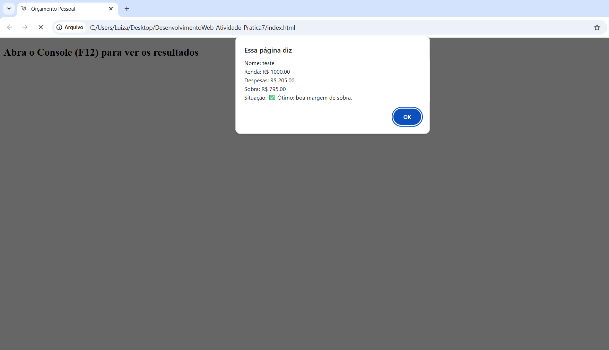

# Atividade Prática - JavaScript Básico

Nome: Luiza Stefany Romão da Silva  
Matrícula: 899094  

## Descrição
Simulador simples de orçamento pessoal utilizando JavaScript.

O programa:
- Lê dados do usuário com prompt()
- Valida entradas com while
- Usa for para repetir despesas
- Aplica regras com if/else
- Exibe resultados no alert e console.log

## Execução
Abrir o arquivo index.html no navegador e pressionar F12 para visualizar o console.

## Print da execução

